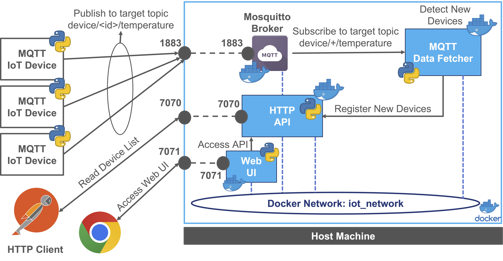
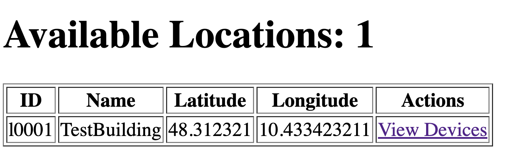
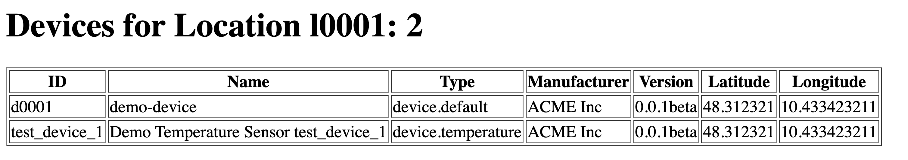

# Microservices IoT Application with Docker - Playground

In this playground, we are going to build and deploy a simple IoT application using Docker containers.
The main concept is to create a simple IoT Inventory system with a RESTful HTTP API to manage locations and devices
integrated with an MQTT Broker to receive telemetry data from IoT devices and register them in the inventory.
Futhermore, we are going to build a simple Web Interface to interact with the inventory system and display the locations and devices.



The main components of the system are:

- **MQTT Broker**: The MQTT broker is used to receive telemetry data from IoT devices and publish them to the subscribers.
- **IoT Inventory**: The HTTP API is used to manage locations and devices in the inventory.
- **MQTT Data Fetcher**: MQTT to HTTP Inventory Integration: The MQTT Data Fetcher is used to subscribe to an MQTT topic and process incoming messages to interact with the Inventory API.
- **Web UI**: The Web Interface is used to interact with the inventory system and display the locations and devices.

The outline of the playground is the following:

- [Create a Docker Network](#create-a-docker-network)
- [MQTT Broker - Eclipse Mosquitto](#mqtt-broker---eclipse-mosquitto)
- [Python - IoT Inventory - RESTful HTTP API](#python---iot-inventory---restful-http-api)
- [MQTT Data Fetcher - MQTT to HTTP Inventory Integration](#mqtt-data-fetcher---mqtt-to-http-inventory-integration)
- [Web UI - IoT Inventory Web Interface](#web-ui---iot-inventory-web-interface)
- [MQTT Temperature Sensor Example](#mqtt-temperature-sensor-example)
- [Run & Test the System](#run--test-the-system)
- [Docker Compose](#docker-compose)

## Create a Docker Network

Since we are going to deploy multiple containers, we need to create a dedicated network to allow communication between them.
**In this way containers can communicate with each other using the container name as the hostname.**
This approach will simplify the configuration and the deployment of the services instead of using the IP address of the host machine.

Create a Docker network to allow the containers to communicate with each other:

```bash
  docker network create iot_network
``` 

Listing the networks:

```bash
  docker network ls
```

All the containers that we are going to build and deploy will be connected to this network to allow communication between them.
In order to connect a container to a network, you can use the following parameter `--network iot_network` at the run time:

```bash
  docker run --name=<container_name> --network iot_network <other_options> <image_name>
```

## MQTT Broker - Eclipse Mosquitto

This section provides a guide for setting up and customizing an MQTT broker using Eclipse Mosquitto.
We use the official eclipse-mosquitto Docker image on Docker Hub ([Link](https://hub.docker.com/_/eclipse-mosquitto)), 
and the version for this example is `2.0.12`.

We "customize" our MQTT broker at runtime with the following configurations:

- Local `mosquitto.conf` file: `-v <LOCAL_PATH>/mosquitto.conf:/mosquitto/config/mosquitto.conf`
- Local `data` folder for persistence: `-v <LOCAL_PATH>/data:/mosquitto/data`
- Local `log` folder for easy access: `-v <LOCAL_PATH>/log:/mosquitto/log`
- Port mapping: `-p 1883:1883`
- Restart always: `--restart always`
- Daemon mode: `-d`

Move to the broker folder

```bash
cd mqtt-broker
```

Run the container

```bash
docker run --name=my-mosquitto-broker --network iot_network -p 1883:1883 -v <LOCAL_PATH>/mosquitto.conf:/mosquitto/config/mosquitto.conf -v <LOCAL_PATH>/data:/mosquitto/data -v <LOCAL_PATH>/log:/mosquitto/log --restart always -d eclipse-mosquitto:2.0.12 --network iot_network
```

Linux version:

```bash
docker run --name=my-mosquitto-broker --network iot_network -p 1883:1883 -v ${PWD}/mosquitto.conf:/mosquitto/config/mosquitto.conf -v ${PWD}/data:/mosquitto/data -v ${PWD}/log:/mosquitto/log --restart always -d eclipse-mosquitto:2.0.12
```

At the end of the test, you can stop and remove the container using the following commands:

```bash
docker stop my-mosquitto-broker
docker rm my-mosquitto-broker
```

## Python - IoT Inventory - RESTful HTTP API

In this example we have a demo implementation of a simple IoT device and location inventory through an HTTP RESTful API. 
It utilizes Flask and Flask RESTful and provides a simple API to manage locations and devices that is going to be 
used by the other components of the system such as the MQTT Data Fetcher and the Web Interface together with
external clients through HTTP requests.

Move to the project folder:

```bash
cd http-api
```

Build the container

```bash
docker build -t http_iot_inventory_api:0.1 .
```

Run the container

```bash
docker run --name=http-inventory-api --network iot_network -p 7070:7070 --restart always -d http_iot_inventory_api:0.1
```

If necessary we can also run with a different configuration

```bash
docker run --name=http-inventory-api --network iot_network -p 7070:7070 -v ${PWD}/target_web_conf.yaml:/app/conf.yaml --restart always -d http_iot_inventory_api:0.1
```

At the end of the test, you can stop and remove the container using the following commands:

```bash
docker stop http-inventory-api
docker rm http-inventory-api
```

## MQTT Data Fetcher - MQTT to HTTP Inventory Integration

This second Python application implements the integration between an MQTT client and an HTTP Inventory API using Paho MQTT library.
The main goal is to subscribe to an MQTT topic and process incoming messages to interact with the Inventory API.
Main implemented features are:

- MQTT Subscription to the topic "device/+/temperature"
- Message Processing with HTTP requests
- GET Request to check device existence
- POST Request to create a new device
- Device Attributes include UUID, Name, Location ID, Type, and customizable attributes

In order to build the container, move to the target folder

```bash
cd data-fetcher
```

Build the container

```bash
docker build -t mqtt_data_fetcher:0.1 .
```

In this case we cannot run the container without the configuration file because the container needs to 
information about the MQTT broker and the HTTP Inventory API to interact with them, so we need to configuration file at runtime.

The configuration file that we can use is named `target_fetcher_conf.yaml` and contains the following parameters:

```yaml
broker_ip: "my-mosquitto-broker"
broker_port: 1883
target_telemetry_topic: "device/+/temperature"
device_api_url: "http://http-inventory-api:7070/api/v1/iot/inventory/location/l0001/device"
```

>**Note:** During the development of the application we are not in the docker environment, 
> so we can use the local configuration file to test the application.
>Only at the deployment time, we need to pass the configuration file to the container.

In this case we use `http://http-inventory-api:7070/api/v1/iot/inventory/location/l0001/device` instead for 
example of `http://192.168.1.123:7070/api/v1/iot/inventory/location/l0001/device` since it is more flexible and
we can use the container name as the hostname to refer to the other containers in the same network.

Furthermore, we cannot use `http://127.0.0.1:7070/api/v1/iot/inventory/location/l0001/device` because we are in a docker environment
and not in the local environment during development phases or internally to the container and the `loopback` refers to the host machine 
instead of the container itself.

At the run time we can pass the configuration file to the container using the `-v` mounting the local 
file with the configuration (`target_fetcher_conf.yaml`) to the container file (`fetcher_conf.yaml`) overwriting the default one.

Run the container with the target configuration file:

```bash
docker run --name=mqtt_data_fetcher --network iot_network -v <LOCAL_PATH>/target_fetcher_conf.yaml:/app/fetcher_conf.yaml --restart always -d mqtt_data_fetcher:0.1
```

Linux version:

```bash
docker run --name=mqtt_data_fetcher --network iot_network -v ${PWD}/target_fetcher_conf.yaml:/app/fetcher_conf.yaml --restart always -d mqtt_data_fetcher:0.1
```

At the end of the test, you can stop and remove the container using the following commands:

```bash
docker stop mqtt_data_fetcher
docker rm mqtt_data_fetcher
```

## Web UI - IoT Inventory Web Interface

This component provides the user interface for the system, allowing users to interact with the 
application through a web browser. It displays location and device information through dedicated pages and tables.

The implementation is based on the following Python Frameworks 

- Flask: https://flask.palletsprojects.com/en/2.0.x/

The web interface interacts with the IoT Inventory API to retrieve and display the information.
The interaction is based on HTTP requests to the API endpoints.

In order to build the container, move to the target folder

```bash
cd web-ui
```

Build the container

```bash
docker build -t web-ui:0.1 .
```

Run the target container with the following configuration file `target_web_conf.yaml` contains a the configuration for the web interface, 
you can use it to overwrite the default configuration in the container.

In particular the configuration contains the following parameters:

```yaml
web:
  host: "0.0.0.0"
  port: 7071
  api_base_url: "http://http-inventory-api:7070/api/v1/iot/inventory"
```

This configuration file is used to set the base URL for the API endpoint, in this case the API is running on the same host as the web interface.
**In this case since we have a dedicated network for the containers, we can use the container name as the hostname.**
Otherwise, you can use the IP address of the host machine and change the configuration file accordingly at every deployment and/or
change of the host machine IP address.

>**Note:** During the development of the application we are not in the docker environment, 
> so we can use the local configuration file to test the application.
>Only at the deployment time, we need to pass the configuration file to the container.

In this case we use `http://http-inventory-api:7070/api/v1/iot/inventory/location/l0001/device` instead for 
example of `http://192.168.1.123:7070/api/v1/iot/inventory/location/l0001/device` since it is more flexible and
we can use the container name as the hostname to refer to the other containers in the same network.

Furthermore, we cannot use `http://127.0.0.1:7070/api/v1/iot/inventory/location/l0001/device` because we are in a docker environment
and not in the local environment during development phases or internally to the container and the `loopback` refers to the host machine 
instead of the container itself.

At the run time we can pass the configuration file to the container using the `-v` mounting the local 
file with the configuration (`target_web_conf.yaml`) to the container file (`conf.yaml`) overwriting the default one.

```bash
docker run --name=web-ui -p 7071:7071 -v <PATH_TO_FILE>/target_web_conf.yaml:/app/web_conf.yaml --restart always -d web-ui:0.1
```

On Linux System you can use the `${PWD}` command to automatically retrieve the path to the current local folder

```bash
docker run --name=web-ui -p 7071:7071 -v ${PWD}/target_web_conf.yaml:/app/web_conf.yaml --restart always -d web-ui:0.1
```

At the end of the test, you can stop and remove the container using the following commands:

```bash
docker stop web-ui
docker rm web-ui
```

## MQTT Temperature Sensor Example

In order to test the system, we can use a simple Python script that simulates a temperature sensor and publishes the data to the MQTT broker.
This Python script provides an example of a simple temperature sensor using the Paho MQTT library to publish temperature data to an MQTT broker.
The script utilizes the Paho MQTT library, so make sure to install it before running the script (or run it inside PyCharm or another IDE that can handle dependencies).

```bash
pip install paho-mqtt
```

Update the configuration variables in the script according to your setup:

```python
device_id = "test_device_1"
client_id = "clientId0001-Producer"
broker_ip = "127.0.0.1"  # Update with your MQTT broker IP
broker_port = 1883       # Update with your MQTT broker port
default_topic = "device/{}/temperature".format(device_id)
message_limit = 1000
```

Run the Python script:

```bash
python your_script_name.py
```

The script establishes a connection to an MQTT broker and continuously publishes simulated temperature data.
The TemperatureSensor class generates random temperature values.
Each message is published to the specified MQTT topic in JSON format using the MessageDescriptor class.
The script sleeps for 5 seconds between each message.\
Feel free to modify the script to suit your specific use case or integrate it into a larger project.

## Run & Test the System

After running all the containers, you can test the system by interacting with the Web Interface or by using the MQTT Temperature Sensor Example.
For example, you can use Postman or a browser to access the API using the following URL [http://127.0.0.1:7070/api/v1/iot/inventory/location](http://127.0.0.1:7070/api/v1/iot/inventory/location)

The result will be something like: 

```json
[
  {
    "uuid": "l0001",
    "name": "TestBuilding",
    "latitude": 48.312321,
    "longitude": 10.433423211,
    "device_list": [
      "d0001"
    ]
  }
]
```

We can also check the list of devices in the location (`l0001`) with the following URL [http://127.0.0.1:7070/api/v1/iot/inventory/location/l0001/device](http://127.0.0.1:7070/api/v1/iot/inventory/location/l0001/device)
The result will be something like: 

```json
[
  {
    "uuid": "d0001",
    "name": "demo-device",
    "locationId": "l0001",
    "type": "device.default",
    "manufacturer": "ACME Inc",
    "software_version": "0.0.1beta",
    "latitude": 48.312321,
    "longitude": 10.433423211
  },
  {
    "uuid": "test_device_1",
    "name": "Demo Temperature Sensor test_device_1",
    "locationId": "l0001",
    "type": "device.temperature",
    "manufacturer": "ACME Inc",
    "software_version": "0.0.1beta",
    "latitude": 48.312321,
    "longitude": 10.433423211
  }
]
```

This response contains a default registered device `d0001` and the device that we are simulating with the MQTT Temperature Sensor Example
with the id `test_device_1`.

Open the Web Interface using the following HTTP URL [http://127.0.0.1:7071/locations](http://127.0.0.1:7071/locations)
it will display the list of locations and devices in a table format. 



And click on the `View Devices` action it is possible to see the list of devices in the location with the associated details
available at the HTTP URL endpoint [http://127.0.0.1:7071/location/l0001/devices](http://127.0.0.1:7071/location/l0001/devices)



## Docker Compose

In order to simplify the deployment and the management of the containers, 
we can use a Docker Compose file to define and run multi-container Docker applications.

The Docker Compose file is a YAML file that defines how Docker containers should behave in production.

>**Note1:** The Docker Compose file should be in the same directory where you run the `docker-compose` command.

> **Note2:** The Docker Compose file should be named `docker-compose.yml` or `docker-compose.yaml`.

> **Note3:** The following Docker Compose file use the ${PWD} command to automatically retrieve the path to the current local folder
> working on Linux System. On Windows System you can explicitly write the path to the file.

The complete Docker Compose file the deployment of the system with its 4 containers and the dedicated network is the following:

```yaml
version: '3.8'

services:

  my-mosquitto-broker:
    container_name: my-mosquitto-broker
    image: eclipse-mosquitto:2.0.12
    ports:
      - "1883:1883"
    volumes:
      - ${PWD}/mosquitto.conf:/mosquitto/config/mosquitto.conf
      - ${PWD}/data:/mosquitto/data
      - ${PWD}/log:/mosquitto/log
    restart: always
    networks:
      - iot_network

  http-inventory-api:
    container_name: http-inventory-api
    image: http_iot_inventory_api:0.1
    ports:
      - "7070:7070"
    volumes:
      - ${PWD}/target_api_conf.yaml:/app/conf.yaml
    restart: always
    networks:
      - iot_network

  web-ui:
    container_name: web-ui
    image: web-ui:0.1
    ports:
      - "7071:7071"
    volumes:
      - ${PWD}/target_web_conf.yaml:/app/web_conf.yaml
    restart: always
    depends_on:
      - http-inventory-api
    networks:
      - iot_network
  
  mqtt_data_fetcher:
    container_name: mqtt_data_fetcher
    image: mqtt_data_fetcher:0.1
    volumes:
      - ${PWD}/target_fetcher_conf.yaml:/app/fetcher_conf.yaml
    restart: always
    depends_on:
      - my-mosquitto-broker
      - http-inventory-api
    networks:
      - iot_network

networks:
  iot_network:
    driver: bridge
```

In order to run the application with the Docker Compose file, you can move to the folder where the file is located and run the following command:

```bash
cd docker-compose
```

Run the application described in the compose file

```bash
docker-compose up
```

You can also run the application as a daemon in background

```bash
docker-compose up -d
```

You can view active containers associated to the composed application: 

```bash
docker-compose ps
```

To view the logs of all running containers at once, run the following command:

```bash
docker-compose logs
```

To view the logs of a specific target docker compose SERVICE NAME (not container name) by its name, run the following command:

```bash
docker-compose logs http-iot-inventory-api
```

To retrieve the four most recent lines of the log from all running containers, run the following command:

```bash
docker-compose logs --tail=4
```

We can continuously watch the log output in real-time by passing the -f (short for "--follow") flag to the docker-compose logs command. Run the following command to stream the logs:

```bash
docker-compose logs -f --tail=4
```

To view the logs generated until five minutes ago, run the following command:

```bash
docker-compose logs --until=5m
```

For example, to view logs that occurred between 3 P.M. and 4 P.M on May 31st, run the following command:

```bash
docker-compose logs –since=2023-05-31T15:00:00 –until=2023-05-31T16:00:00
```

You can stop the entire application with all its container using:

```bash
docker-compose down
```

You can stop, remove everything with the following command: 

```bash
docker-compose rm -fsv
```
