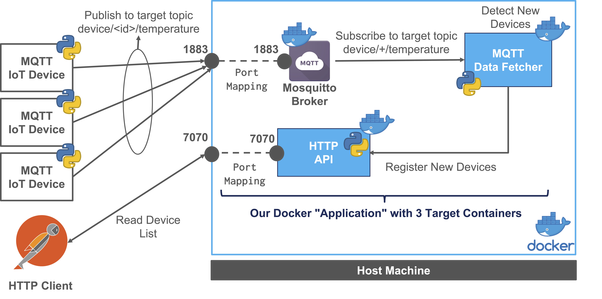

# IoT Integration with MQTT and HTTP Inventory

The target use case demo and deployment with Docker will be the following: 



## MQTT Broker - Eclipse Mosquitto

This section provides a guide for setting up and customizing an MQTT broker using Eclipse Mosquitto.
We use the official eclipse-mosquitto Docker image, and the version for this example is 2.0.12.

### Customization
We customize our MQTT broker at runtime with the following configurations:

- Local mosquitto.conf file: -v <LOCAL_PATH>/mosquitto.conf:/mosquitto/config/mosquitto.conf
- Local data folder for persistence: -v <LOCAL_PATH>/data:/mosquitto/data
- Local log folder for easy access: -v <LOCAL_PATH>/log:/mosquitto/log
- Port mapping: -p 1883:1883
- Restart always: --restart always
- Daemon mode: -d

### Run Command

Move to the broker folder

```bash
cd mqtt-broker
```

Run the container

```bash
docker run --name=my-mosquitto-broker -p 1883:1883 -v <LOCAL_PATH>/mosquitto.conf:/mosquitto/config/mosquitto.conf -v <LOCAL_PATH>/data:/mosquitto/data -v <LOCAL_PATH>/log:/mosquitto/log --restart always -d eclipse-mosquitto:2.0.12
```

Linux version:

```bash
docker run --name=my-mosquitto-broker -p 1883:1883 -v ${PWD}/mosquitto.conf:/mosquitto/config/mosquitto.conf -v ${PWD}/data:/mosquitto/data -v ${PWD}/log:/mosquitto/log --restart always -d eclipse-mosquitto:2.0.12
```

### Stop & Remove

```bash
docker stop my-mosquitto-broker
docker rm my-mosquitto-broker
```

## Python - IoT Inventory - Demo RESTful HTTP API


This section presents a demo implementation of a simple IoT device and location inventory through an HTTP RESTful API. It utilizes Flask and Flask RESTful.

### Build & Run

Move to the project folder and build the container:

```bash
cd http-api
docker build -t http_iot_inventory_api:0.1 .
```

Run the container

```bash
docker run --name=http-inventory-api -p 7070:7070 --restart always -d http_iot_inventory_api:0.1
```

Run with a different configuration

```bash
docker run --name=http-inventory-api -p 7070:7070 -v ${PWD}/test_conf.yaml:/app/conf.yaml --restart always -d http_iot_inventory_api:0.1
```

Stop and remove

```bash
docker stop http-inventory-api
docker rm http-inventory-api
```

## MQTT to HTTP Inventory Integration

This Python application demonstrates the integration between an MQTT client and an HTTP Inventory API using Paho MQTT library.

### Features

- MQTT Subscription to the topic "device/+/temperature"
- Message Processing with HTTP requests
- GET Request to check device existence
- POST Request to create a new device
- Device Attributes include UUID, Name, Location ID, Type, and customizable attributes

### Usage

- Install required libraries: pip install paho-mqtt.
- Replace "your_mqtt_broker_host" with the actual MQTT broker hostname or IP address.
- Run the script to connect to the MQTT broker and react to incoming messages.

### Docker Execution

Move to the target folder

```bash
cd data-fetcher
```

Build the container

```bash
docker build -t mqtt_data_fetcher:0.1 .
```

Run the container

```bash
docker run --name=mqtt_data_fetcher --restart always -d mqtt_data_fetcher:0.1
```

Run the container with a different configuration file

```bash
docker run --name=mqtt_data_fetcher -v ${PWD}/test_fetcher_conf.yaml:/app/fetcher_conf.yaml --restart always -d mqtt_data_fetcher:0.1
```

Stop and remove

```bash
docker stop mqtt_data_fetcher
docker rm mqtt_data_fetcher
```

## MQTT Temperature Sensor Example

This Python script provides an example of a simple temperature sensor using the Paho MQTT library to publish temperature data to an MQTT broker. The script utilizes the Paho MQTT library, so make sure to install it before running the script:

```bash
pip install paho-mqtt
```

### Configuration

Update the configuration variables in the script according to your setup:

#### Configuration variables

```python
device_id = "test_device_1"
client_id = "clientId0001-Producer"
broker_ip = "127.0.0.1"  # Update with your MQTT broker IP
broker_port = 1883       # Update with your MQTT broker port
default_topic = "device/{}/temperature".format(device_id)
message_limit = 1000
```

### Running the Script

Run the Python script:

```bash
python your_script_name.py
```

## Script Overview

The script establishes a connection to an MQTT broker and continuously publishes simulated temperature data.
The TemperatureSensor class generates random temperature values.
Each message is published to the specified MQTT topic in JSON format using the MessageDescriptor class.
The script sleeps for 5 seconds between each message.\
Feel free to modify the script to suit your specific use case or integrate it into a larger project.

## MQTT and HTTP Inventory API Docker Compose

This Docker Compose configuration sets up two services: an MQTT broker using Eclipse Mosquitto and an HTTP Inventory API.

### Mosquitto Broker

#### Configuration

- **Container Name:** my-mosquitto-broker
- **Image:** eclipse-mosquitto:2.0.12
- **Ports:** 1883:1883
- **Volumes:**
  - `${PWD}/mosquitto.conf:/mosquitto/config/mosquitto.conf`
  - `${PWD}/data:/mosquitto/data`
  - `${PWD}/log:/mosquitto/log`
- **Restart:** always

### HTTP Inventory API

#### Configuration

- **Container Name:** http-inventory-api
- **Image:** http_iot_inventory_api:0.1
- **Ports:** 7070:7070
- **Volumes:** $(pwd)/test_conf.yaml:/app/conf.yaml
- **Restart:** always

### Usage

Run the application described in the compose file

```bash
docker-compose up
```

You can also run the application as a daemon in background

```bash
docker-compose up -d
```

Check the API using PostMan or a browser accessing the target API with the associated configuration file:

```bash
http://127.0.0.1:7070/api/v1/iot/inventory/location
```

You can view active containers associated to the composed application: 

```bash
docker-compose ps
```

To view the logs of all running containers at once, run the following command:

```bash
docker-compose logs
```

To view the logs of a specific target docker compose SERVICE NAME (not container name) by its name, run the following command:

```bash
docker-compose logs http-iot-inventory-api
```

To retrieve the four most recent lines of the log from all running containers, run the following command:

```bash
docker-compose logs --tail=4
```

We can continuously watch the log output in real-time by passing the -f (short for "--follow") flag to the docker-compose logs command. Run the following command to stream the logs:

```bash
docker-compose logs -f --tail=4
```

To view the logs generated until five minutes ago, run the following command:

```bash
docker-compose logs --until=5m
```

For example, to view logs that occurred between 3 P.M. and 4 P.M on May 31st, run the following command:

```bash
docker-compose logs –since=2023-05-31T15:00:00 –until=2023-05-31T16:00:00
```

You can stop the entire application with all its container using:

```bash
docker-compose down
```

You can stop, remove everything with the following command: 

```bash
docker-compose rm -fsv
```
